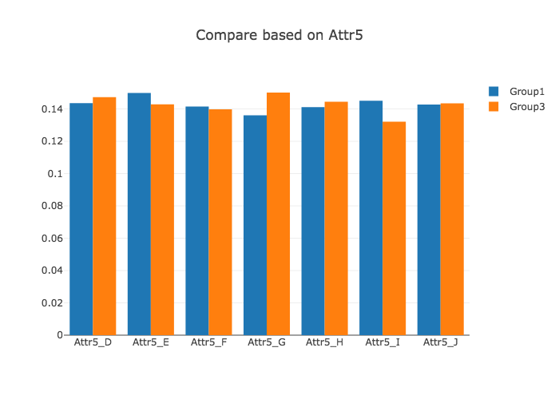
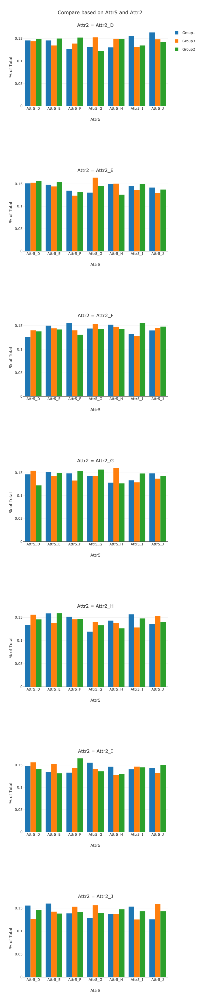

# dash_sample

## Profiling Tool

Try to create a online tool to compare the distribution for two different data set (with same attributes), only descrete values are considered.

- run the notebook to create demo data set
- Run the flask to check the online demo

```bash
python profiling.py
```

### Compare *Two* groups, based on *One* attribute



### Compare *Three* groups, based on *Two* attribute



### Youtube Demo
[](https://www.youtube.com/watch?v=YHFgc3eAt80)